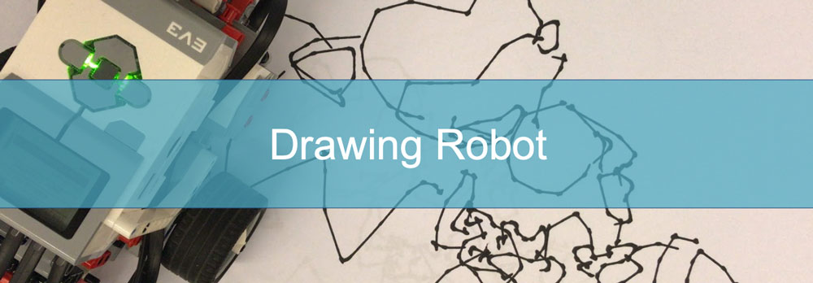
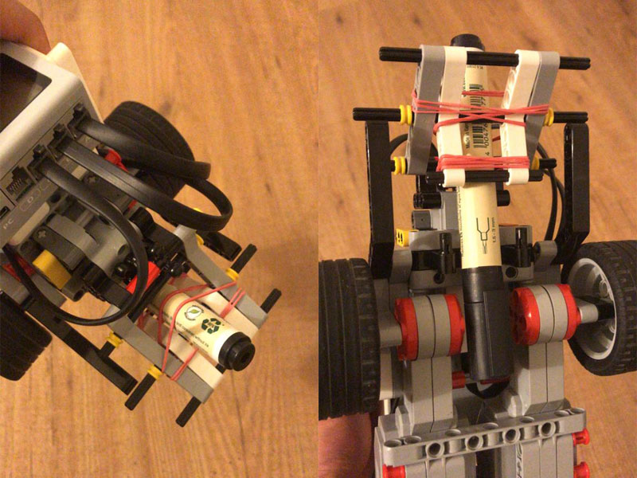
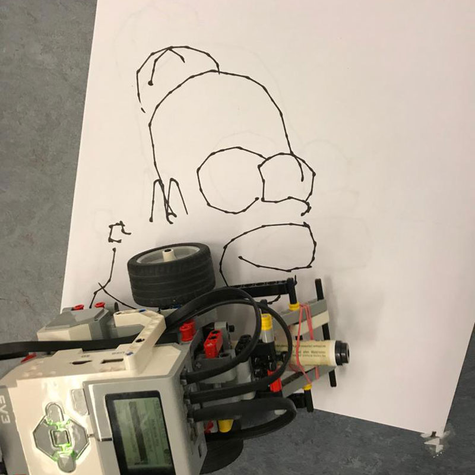
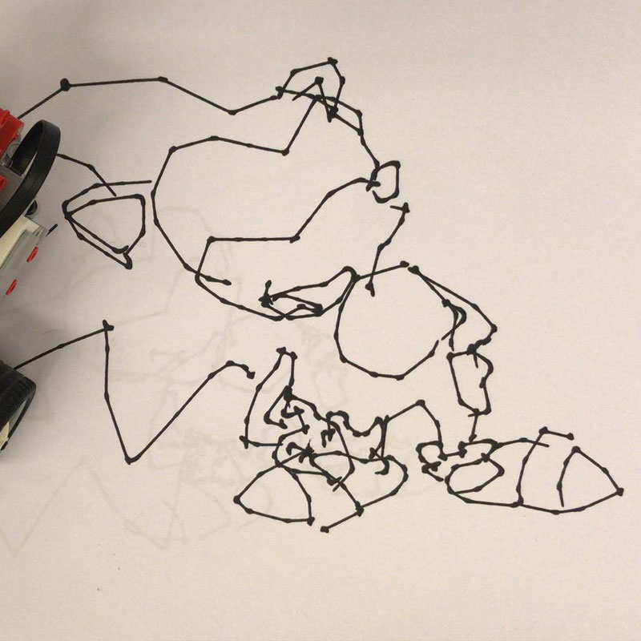

# Drawing Robot using LEGO Mindstorms EV3
## Initiation & Goal

The development of this software was initiated and encouraged by the class Hardware-Praktikum (Internship) at the Leibniz Universität Hannover.
The goal of this project was to assemble a robot using the normal and the extended packs of the LEGO Mindstorms EV3 with the aim to draw a caricature of a given person on a piece of paper. This includes moving on the paper and lifting/lowering the pen when needed.

## Software
For this purpose, the Linux-based operating system [ev3dev](https://www.ev3dev.org) was used. From the [ev3dev](https://www.ev3dev.org) website:
> ev3dev is a Debian Linux-based operating system that runs on several LEGO® MINDSTORMS compatible platforms including the LEGO® MINDSTORMS EV3 and Raspberry Pi-powered BrickPi.

Since the main programming language which is used for this repo is C, the needed libraries need to be installed on the device. In order to to do so please follow the instructions on [ev3dev-c](https://github.com/in4lio/ev3dev-c).

## Hardware
The needed sensors and motors are:

1. two motors for the wheels
2. one motor to lift and lower the pen
3. a Gyroscope sensor

To create a perfect caricature, the pen needs to be placed exactly between the two axes of the tires. Our approach is as follows:

When the handler is moved down, the pen is lifted from the paper and when the handler moves up, the pen lands on the paper again.

## Placing the Robot
The robots needs to be place on the paper so that it has the papers edges on its left and in front of it. This point would be (0,0) for the coordinates. After placing the robot on the paper, the gyroscope needs to be detached and connected again in order for it to be reseted and calibrated to 0.
## Executing the Code on the Robot
In order to clone this repository to your ev3dev brick, you will have to install the needed libraries of [ev3dev-c](https://github.com/in4lio/ev3dev-c) first.
After that, copy the folder "code" to your ev3dev brick.
Navigate to the folder and compile "main.c" using the following command:

`gcc main.c -lev3dev-c -lm -o main`

After compiling has finished, execute the code using `./main`.

##Installed Caricatures
The default caricature which is available under main.c is a caricature of "Homer Simpson":

You can also choose between "Sonic", "Bugs bunny" and "Batman".

In order to change the caricature, open `main.c` and comment out everything which has anything to do with homer. Uncomment the parts with your desired comic figure and compile/run again.
You can also add your own caricature coordinates by preparing an array of coordinates which have no negative values and are integers.